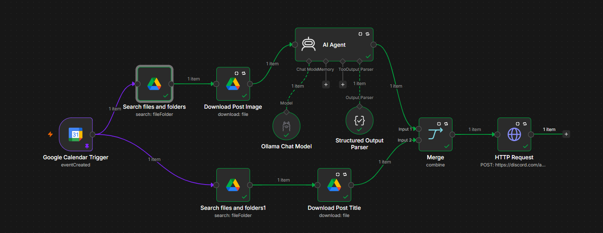
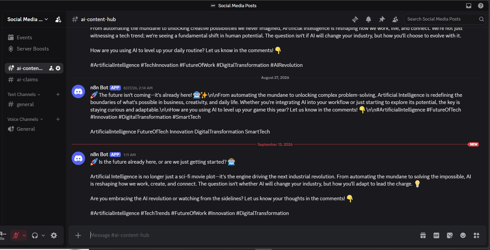

# Discord AI Social Media Automation (n8n)


An n8n workflow that automatically generates and posts AI social media content to Discord, triggered by a Google Calendar event.

> **Scope note:** the original planning doc for this project covered both Discord and Telegram, and used Groq for caption generation. What's actually built and working right now is **Discord only**, using a local **Ollama** model (`gemma4:31b`) instead of Groq. This README describes the workflow as implemented. Telegram posting and the Groq integration are listed under [Roadmap](#roadmap) as not-yet-built. See [docs/planning-doc.md](docs/planning-doc.md) for the original plan.

## Demo

[Watch the walkthrough on Loom](https://www.loom.com/share/2f20d890db084d87bb336b378c96bd17)




## How it works

```
Google Calendar Event (new event created)
        ↓
n8n Trigger (polls every minute)
        ↓
Google Drive — find + download post image
Google Drive — find + download post title/topic text
        ↓
AI Agent (Ollama: gemma4:31b) — analyzes image, writes caption + hashtags
        ↓
Structured Output Parser — enforces JSON schema (caption, hashtags, etc.)
        ↓
Merge — combines AI output with the downloaded text
        ↓
HTTP Request → Discord Webhook — posts the final message
```

## Repo contents

```
discord-ai-automation/
├── README.md
├── LICENSE
├── .gitignore
├── docs/
│   └── planning-doc.md              # original planning notes (Discord + Telegram, Groq)
├── Images_of_Workflow/
│   ├── Workflow.PNG                 # n8n workflow canvas screenshot
│   └── Discord_Posting.PNG          # example output in Discord
└── workflows/
    └── discord-ai-posting.json      # n8n workflow export (sanitized)
```

## Setup

1. **Discord**
   - Create a server and a text channel (e.g. `ai-content-hub`).
   - Channel Settings → Integrations → Webhooks → New Webhook → copy the URL.
2. **Google Drive**
   - Store the post image and a topic/title text file per post.
   - Update the `queryString` filters in the "Search files and folders" nodes to match your file naming.
3. **Google Calendar**
   - Create a calendar (e.g. "Social Media Posts") and add events — each new event triggers a post.
4. **Ollama**
   - Run Ollama locally/remotely and pull the model referenced in the workflow (or swap in another chat model node).
5. **Import into n8n**
   - Import `workflows/discord-ai-posting.json`.
   - This file is sanitized — every credential, calendar ID, and webhook URL is a placeholder (`ADD_YOUR_...`). Reconnect the Google Calendar / Google Drive OAuth credentials in n8n, and replace each placeholder with your own values.
   - Paste your real Discord webhook URL into the final HTTP Request node — **do not commit that URL to git**. Use an n8n credential or environment variable instead.

## ⚠️ Security note

The original JSON export contained a **live Discord webhook URL** hard-coded in the HTTP Request node, plus real OAuth credential references and a personal calendar ID. Webhook URLs act as bearer credentials — anyone with the URL can post to your channel. All of these have been replaced with placeholders in this repo. Keep your real values out of git (use n8n's credential store, or a `.env` file that's git-ignored).

## Roadmap

- [ ] Telegram posting (parallel to Discord)
- [ ] Swap/optionally add Groq API for caption generation
- [ ] Manual approval step before posting
- [ ] Multi-post scheduling
- [ ] Content database (Airtable/Sheets) instead of Drive folders

## License

This project is licensed under the [MIT License](LICENSE).
